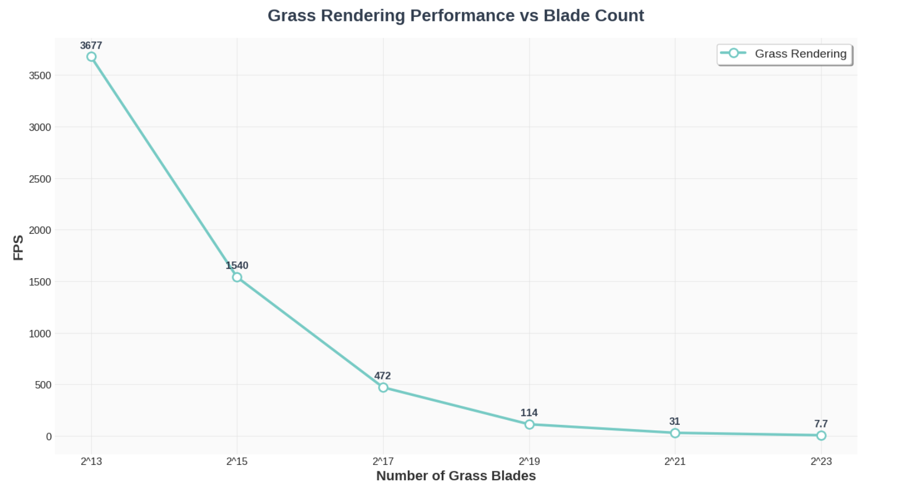

Vulkan Grass Rendering
==================================

**University of Pennsylvania, CIS 565: GPU Programming and Architecture, Project 5**

* Muqiao Lei
  
  [LinkedIn](https://www.linkedin.com/in/muqiao-lei-633304242/) · [GitHub](https://github.com/rmurdock41)

* Tested on: Windows 10, 11th Gen Intel(R) Core(TM) i7-11800H @ 2.30GHz 2.30 GHz, NVIDIA GeForce RTX 3060 Laptop GPU (Personal Computer)

---

## Project Overview

This project implements a grass rendering system based on the paper [*Responsive Real-Time Grass Rendering for General 3D Scenes*](https://www.cg.tuwien.ac.at/research/publications/2017/JAHRMANN-2017-RRTG/JAHRMANN-2017-RRTG-draft.pdf). Each grass blade is represented as a Bezier curve and simulated on the GPU using compute shaders with physics forces (gravity, recovery, wind). The system generates blade geometry through tessellation and optimizes rendering with three culling techniques. A distance-based LOD system dynamically adjusts tessellation levels, a procedural skybox provides the background, and Lambert lighting with rim light enhances the grass shading.

---

## Features

### Bezier Curve Blade Representation

Each grass blade is represented as a quadratic Bezier curve with three control points. **v0** is the blade base position with its w component storing the orientation angle. **v1** is the middle Bezier control point with its w component storing the blade height. **v2** is the physics simulation target point with its w component storing the blade width.

 The **up** vector defines the blade's upward direction with its w component storing the stiffness coefficient. Grass blades are randomly generated in `Blades.cpp`, with position, height, width, and orientation randomly distributed across the plane. 

The initial position of v2 is at height above v0, with an added random horizontal offset (**bendOffset**) that gives blades different initial bending directions and angles for visual variety. 

The data is stored in three buffers: **bladesBuffer** stores input blade data, **culledBladesBuffer** stores blades after culling, and **numBladesBuffer** records indirect draw commands and the remaining blade count.

---

#### GPU Physics Simulation - Gravity

Physics simulation is performed in the compute shader, calculating forces on all grass blades each frame. Gravity consists of two components: environmental gravity `gE = vec3(0.0, -9.8, 0.0)` pointing toward the ground, and frontal gravity `gF = 0.25 * length(gE) * front`, where front is the blade's facing direction calculated by `cross(up, tangent)`. The total gravity is `gravity = gE + gF`, creating a natural drooping effect on the blades.

#### GPU Physics Simulation - Recovery Force

Recovery force is calculated as `recovery = (iv2 - v2) * stiffness`, where `iv2 = v0 + up * height` is the initial position of v2 when the blade is upright. The force magnitude is controlled by the stiffness coefficient - higher stiffness produces stronger recovery force and stiffer blades.

#### GPU Physics Simulation - Wind Force

Wind force uses a sinusoidal wave pattern: `windWave = sin(totalTime * 2.0 + v0.x * 0.5 + v0.z * 0.5)`, which creates wave propagation across the grass field based on blade position. The base wind is calculated as `wind = windDirection * windStrength * windWave`. Directional alignment `directionalAlignment = 1.0 - abs(dot(normalize(wind), normalize(v2 - v0)))` and height ratio `heightRatio = dot(v2 - v0, up) / height` are calculated, with final wind force `wind *= directionalAlignment * heightRatio`. After summing all forces and updating v2 position, length correction `r = height / L` maintains blade length, where L is the current curve length calculated as `L = (2.0 * L0 + L1) / 3.0`. The corrected v1 and v2 are written back to the inputBlades buffer.

---

#### Culling Techniques - Orientation Culling

Orientation culling removes grass blades perpendicular to the view direction, as these blades occupy very few pixels on screen or are invisible. The camera position is calculated as `cameraPos = inverse(camera.view)[3].xyz` and view direction as `viewDir = normalize(v0 - cameraPos)`. The blade facing direction is computed as `bladeDir = normalize(cross(up, front))`. When `abs(dot(viewDir, bladeDir)) > 0.9`, the blade is nearly perpendicular to the view direction and is culled from rendering.

#### Culling Techniques - View-Frustum Culling

View-frustum culling removes grass blades outside the camera's view. Three points are tested: v0 (base), v2 (tip), and m (midpoint, calculated as `m = 0.25 * v0 + 0.5 * v1 + 0.25 * v2`). These points are projected to clip space: `clipV0 = camera.proj * camera.view * vec4(v0, 1.0)`. For each clip space coordinate, `h = clipPos.w + tolerance` is calculated, where tolerance is 1.0 to provide some margin. A point is inside the frustum when `abs(clipPos.x) <= h && abs(clipPos.y) <= h && abs(clipPos.z) <= h`. A blade is only culled when all three points are outside the frustum.

#### Culling Techniques - Distance Culling

Distance culling performs probabilistic culling based on blade distance from the camera. The distance is calculated as `dist = length(v0 - cameraPos)`, and blades beyond maxDistance (50.0) are immediately culled. For blades within range, the distance is divided into 10 buckets, with `bucket = int(dist / bucketSize)`. A position-based hash function `hash = uint(v0.x * 12345.0 + v0.z * 67890.0 + index * 1000)` generates a pseudo-random value, and the cull probability is `cullProbability = float(bucket) / float(numBuckets)`. Farther buckets have higher cull probability, determined by `(hash % 100) / 100.0 < cullProbability`. Blades passing all culling tests are written to the culledBlades buffer using `atomicAdd`.

---

### Tessellation and LOD System

*Different LOD levels are visualized with colors*

Grass blades passing all culling tests are sent to the graphics pipeline's tessellation stage. The **vertex shader** passes Bezier curve control points (**v0**, **v1**, **v2**, **up**) to the **tessellation control shader**. In the tessellation control shader, the distance between the blade and camera is calculated as `dist = length(cameraPos - bladePos)`, and tessellation level is dynamically set based on distance: **5 levels** for distances under 10 meters (high detail), **3 levels** for 10-25 meters (medium detail), and **2 levels** beyond 25 meters (low detail). This LOD system implements smooth transitions via `tessLevel = mix(5.0, 1.0, smoothstep(5.0, 50.0, dist))`, avoiding abrupt tessellation changes. Tessellation levels are set through **gl_TessLevelInner[0]** and **gl_TessLevelOuter**, controlling the number of vertices generated along the blade height.

The **tessellation evaluation shader** receives subdivided parametric coordinates **(u, v)**, where v runs along blade height (0 to 1) and u along width (0 to 1). Then calculate points on the Bezier curve: `a = v0 + v * (v1 - v0)`, `b = v1 + v * (v2 - v1)`, `c = a + v * (b - a)`, yielding the position at height v on the blade centerline. Blade width tapers along height, calculated as `currentWidth = width * (1.0 - v)`, widest at the base and narrowing at the tip. Using tangent direction `t1 = vec3(sin(orientation), 0.0, cos(orientation))`, the center point is offset laterally to generate a quad: `c0 = c - currentWidth * t1`, `c1 = c + currentWidth * t1`, with final vertex position `worldPos = mix(c0, c1, u)`. The normal is calculated via `cross(t1, tangentAlongBlade)` and flipped based on u value to ensure correct orientation.

---

### Procedural Skybox

The skybox is rendered first each frame, before all other geometry. It uses a separate **graphics pipeline** with depth test set to **VK_COMPARE_OP_LESS_OR_EQUAL** and depth write disabled, ensuring the skybox always appears at the farthest distance without occluding other objects. The skybox geometry is a **unit cube** (36 vertices). In the vertex shader, the translation component is removed from the view matrix, preserving only rotation, so the skybox rotates with the camera but does not move with it. The fragment shader uses **procedural methods** to generate sky color gradients, sun, and cloud effects without relying on texture maps. When the window is resized, the skybox pipeline is rebuilt in **RecreateFrameResources()** to ensure the viewport updates correctly.

### Grass Blade Shading

The fragment shader implements multiple lighting techniques to enhance grass visual quality. Base color transitions between dark green at the base and light green at the tip through height-based interpolation. A **Lambert diffuse lighting model** simulates sunlight. **Wrap-around lighting** technique `diffuse = (NdotL + 0.5) / 1.5` produces softer shading transitions, avoiding harsh shadow boundaries. **Rim light** effect is calculated from normal and view direction, using a power function to create sharp falloff, adding a pale yellow-green outline at blade edges to enhance depth perception. The final color combines **ambient light**, **diffuse light**, and **rim light**.

---

## Performance Analysis

#### blade count

Tests  at **640x480 resolution** to measure the impact of grass blade count on frame rate.

| Blade Count      | FPS  |
| ---------------- | ---- |
| 2^13 (8,192)     | 3677 |
| 2^15 (32,768)    | 1540 |
| 2^17 (131,072)   | 472  |
| 2^19 (524,288)   | 114  |
| 2^21 (2,097,152) | 31   |
| 2^23 (8,388,608) | 7.7  |

Performance bottlenecks come from three main stages. The **compute shader** physics simulation calculates gravity, recovery force, and wind force for each blade, with computation scaling linearly with blade count. The **tessellation stage** generates vertices for each blade based on LOD level, with higher tessellation producing more geometry. The **fragment shader** computes Lambert diffuse and rim light for all generated pixels, with pixel count depending on the screen area covered by grass blades.

#### Culling

Tests were conducted with **2^19 (524,288) blades** at **640x480 resolution** to evaluate the effectiveness of different culling techniques.

**Test Data:**

| Culling Configuration | FPS |
| --------------------- | --- |
| No Culling            | 64  |
| Orientation Only      | 94  |
| Frustum Only          | 71  |
| Distance Only         | 83  |
| All Culling           | 114 |

**Orientation culling** shows the most significant impact, improving performance from 64 FPS to 94 FPS (46.9% increase), as it removes large numbers of blades perpendicular to the view direction that are nearly invisible on screen but still require processing. **Distance culling** provides a 29.7% performance gain (83 FPS) by probabilistically removing distant blades to reduce rendering load. **Frustum culling** shows the smallest improvement (71 FPS, 10.9% increase), as most blades remain within view in scenes with wide camera angles and flat terrain.

When all three culling techniques are combined, FPS reaches 114, representing a 78.1% improvement over no culling. The effects of culling techniques do not simply add up, as different methods overlap (the same blade may satisfy multiple culling conditions simultaneously). In high blade count scenarios, the culling system is essential for maintaining real-time performance.

#### LOD System

Tests were conducted with **2^19 (524,288) blades** at **640x480 resolution** with the camera positioned far enough to trigger LOD.

| LOD Configuration | FPS |
| ----------------- | --- |
| No LOD            | 399 |
| With LOD          | 573 |

The LOD system provides a 43.6% performance improvement (from 399 FPS to 573 FPS). When the camera is distant, most blades are reduced to 2-3 tessellation levels, significantly decreasing the vertex count generated by the tessellation evaluation shader. Without LOD, all blades use a fixed 5-level tessellation, generating excessive geometry with details imperceptible at distance. The LOD system dynamically adjusts tessellation levels to substantially reduce rendering load while maintaining visual quality, demonstrating the effectiveness of distance-based tessellation optimization.
